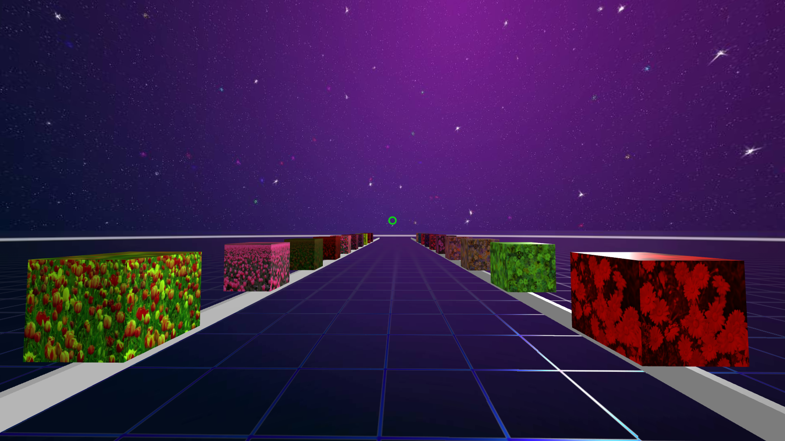

# Concept Design

This mixed-reality system is a new way to explore flowers. Using state of the art technologies, the system improves how we analyze and visualize flowers, with their health and vitality being a tangible information. 

Visualizing this is the first step to get insights on how to improve the general process in the factory.

Boxes are organized by allotment or type. Each box has smaller flower cubes. A scanner will take pictures of the boxes, uploading them to a database on the cloud. Later on, a machine learning model will extract features for inteligence analisis. Features are informations such as their color and health percentage.

With the informations available, now comes the visualization step. This whole system includes three sub-systems: One machine learning model to understand the data, one virtual reality system to visualize the data, and one augmented reality system to expand the limits and acquire insights.

***

### **The Machine Learning Model:** 

This first part of the system is the one that understands the health percentage in a box of flowers or which kind of flower it is. Saving this information for later usage.

Machine learning is growing as an important field of technology. It is known as a universal function aproximator. It works by giving the computer lots of examples and then adjusting the relationship between inputs and outputs. Being able to save the learning model is important because of the cost of the training process.

For example, if we want to teach a neural network to classify a sunflower, we will take several sunflower-labeled pictures, insert them into a ML model which adjusts itself based on each pixel of an image. 

After the training process, the model learns how does a sunflower looks like. We are able to take real time images and classify them as sunflower or other plants. Based on this process, we can do the same with plant-diseases, health, colors, and many different cases. 

*** 

### **The VR:**

This is an experience taking place in a computer-generated environment so we can explore it with our senses. The virtual reality system immerse the user on a 3D corridor with moving shapes on both sides.

The interface is gaze controlled, this means that when we look at an option for more than 3 seconds, we select it. 
Initially, the user has 3 options: Start, Stop, Or choose a box. 

If the user selects the start option, the flowers begin running on on both side tracks. If the user gaze at the stop option, the tracks stop. And if the user gaze at a specific box for more than 3 seconds, then the system brings this chosen box for a closer observation, moving it to the front and opening a secondary interface with all the data about the box of flowers.

*** 
### **The AR:**

As a way of expanding information, we are aiming at an experience where the boxes are augmented by a generated model.

Into an augmented reality system the flower boxes are interactive. Making use of technology to expand horizons between human-computer interactions.

The value of this system is that it brings components of digital information into a user perception of the real world. And it's more than just simple display of data, it can expand observation of the flowers anywhere at anytime.

The AR system will be used to enhance the other two systems. Offering sensitive experiences while adding object recognitions and making information about the flower boxes interactive and digitally manipulable.

